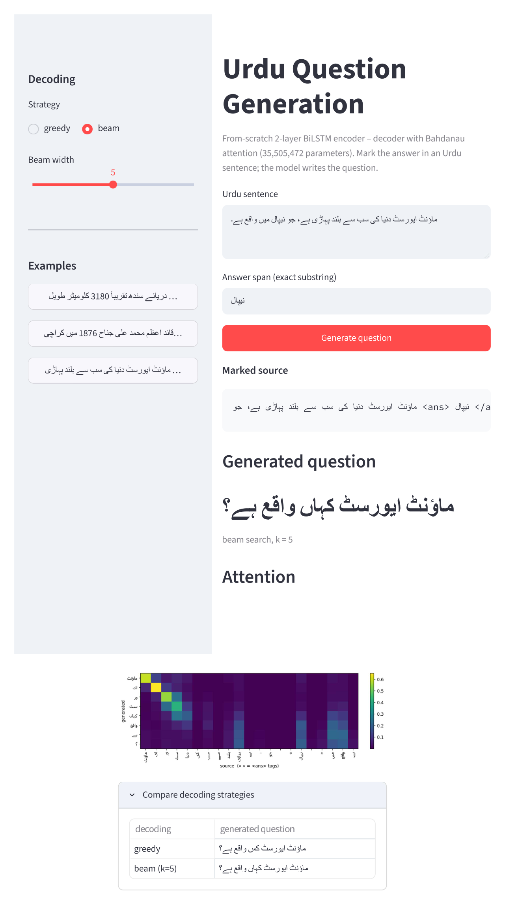

# Urdu Question Generation (seq2seq, from scratch)

Given an Urdu sentence with the answer marked as `<ans> … </ans>`, generate the
question that the answer responds to.

> Example — `دریائے سندھ تقریباً <ans> 3180 کلومیٹر </ans> طویل ہے۔`
> → `دریائے سندھ کی لمبائی کتنی ہے؟`

An RNN encoder–decoder with attention, built from primitives (`nn.Embedding`,
`nn.LSTM`, `nn.Linear`). No pretrained weights, no Transformers, no off-the-shelf
seq2seq. Own SentencePiece subword vocabulary (8k).

## Architecture

| Part | Choice |
|---|---|
| Encoder | 2-layer **bidirectional** LSTM, embedding 256, hidden 512, dropout 0.3 |
| Bridge | linear map from the final encoder state to the decoder's initial state |
| Attention | Bahdanau (additive): `score = v·tanh(Wₑ·h_enc + W_d·s_dec)`, masked over pad |
| Decoder | 2-layer LSTM with input-feeding, linear readout over the 8k vocab |
| Training | teacher forcing, padding-masked cross-entropy, Adam, grad-clip 1.0, `ReduceLROnPlateau` |
| Decoding | greedy **and** beam search (k=5) |

## Two ways to read this project

| You want… | Look at |
|---|---|
| **One self-contained notebook** — every step inline, run top to bottom on Kaggle | [`notebooks/Urdu_Question:Answer.ipynb`](notebooks/Urdu_Question:Answer.ipynb) |
| **Modular `.py` code** — the same pipeline as a package, with a thin driver notebook | [`src/`](src/) + [`notebooks/train_urdu_qg.ipynb`](notebooks/train_urdu_qg.ipynb) |

The standalone notebook contains the complete data-preparation, tokenizer, model,
training, decoding, attention-visualisation, and evaluation workflow inline. The
modular implementation splits the production pipeline across `src/` modules and
uses the driver notebook to run it.

## Repository layout

```
notebooks/
  Urdu_Question:Answer.ipynb — self-contained: data → tokenizer → model → train → eval → attention plots
  train_urdu_qg.ipynb       — thin wrapper: clones the repo and runs the src/ modules
src/            data_prep, spm_train, dataset, model, train, decode, evaluate
app/            app.py               — Streamlit front end
results/        metrics.json, samples.tsv, human_eval.csv, tables.md, figures/ (+ figures/examples/ — 10 front-end runs, 5 good / 5 bad)
blog/           medium_blog.md, linkedin_post.md
docs/EXPLAIN.md per-module notes
```

## Setup (local — evaluation and the front end)

```bash
python -m venv .venv
.venv\Scripts\activate            # Windows;  source .venv/bin/activate elsewhere
pip install -r requirements.txt
```

## Pipeline
| Step | Command | Where |
|---|---|---|
| 1. Data prep (Task 1) | `python -m src.data_prep` | local or Kaggle (needs internet) |
| 2. Tokenizer (Task 2) | `python -m src.spm_train` | local or Kaggle |
| 3. Debug gate | `python -m src.train --debug` | 10k pairs, 1 epoch — loss must fall |
| 4. Train (Task 3) | `python -m src.train --epochs 15` | **Kaggle GPU** (~1–2 h) |
| 5. Evaluate (Task 4) | `python -m src.evaluate --split both` | local or Kaggle |
| 6. Front end (Task 5) | `streamlit run app/app.py` | local |

On Kaggle, either notebook runs steps 1–5 and zips `artifacts/` + `results/` (+ the
TSVs) to `/kaggle/working/outputs.zip`. Download it, unpack into the repo root, then
run the front end locally.

`artifacts/best.pt` (trained weights, ~140 MB) is produced by step 4 and is too large
for the repo — download it from the
[v1.0 release](https://github.com/Hanzala-12/urdu-question-generation/releases/tag/v1.0)
and place it at `artifacts/best.pt` before running evaluation or the front end.

## Results

Urdu_Question:Answer trained a 24.87 M-parameter model for 15 epochs on a Tesla
T4 (~90.6 min). Validation loss reached its best recorded value at epoch 13
(4.2405). The notebook's final validation perplexity was 75.45. It produced
75,067 training pairs and 10,018 validation pairs after filtering. These figures
come from the saved outputs in
[`notebooks/Urdu_Question:Answer.ipynb`](notebooks/Urdu_Question:Answer.ipynb); the modular
pipeline results in [`results/`](results/) were produced by a different run.

| Split | Decoding | BLEU-4 | ROUGE-L | PPL | `<unk>`% |
|---|---|---|---|---|---|
| UQA valid (200 examples) | greedy | 3.02 | 0.199 | 75.45 | 1.26 |
| UQA valid (200 examples) | beam k=5 | 2.39 | 0.181 | 75.45 | 0.97 |
| Wiki-UQA (177 usable examples) | greedy | 1.15 | 0.179 | 75.45 | 2.76 |
| Wiki-UQA (177 usable examples) | beam k=5 | 2.15 | 0.169 | 75.45 | 1.58 |

The notebook scores UQA on the first 200 validation examples and Wiki-UQA on
177 usable examples. ROUGE-L is computed with whitespace tokenization in this
version, so the nonzero ROUGE-L values are directly comparable within this run.

**The decoding result is split by domain.** Greedy decoding is better on the
UQA sample (BLEU-4 3.02 vs. 2.39), while beam search is better on Wiki-UQA
(2.15 vs. 1.15). This run therefore does not support a universal claim that
beam search helps or hurts; the result changes with the evaluation split.



## Limitations

The Urdu_Question:Answer outputs show a substantial quality gap despite low
single-digit
BLEU scores:

- **Content grounding is weak** — generated questions frequently omit the marked
  answer, replace source entities, or use unrelated names and facts.
- **Template repetition is common** — many predictions reuse generic Urdu
  question patterns and malformed filler phrases.
- **Answerability is the main failure** — both human raters marked 0% of the
  sampled greedy and beam questions as answerable.
- **Human quality is low** — fluency was 0–10% for greedy and 12% for beam;
  relevance was 4–14% for greedy and 8–20% for beam.
- **Rater agreement is uneven** — Cohen's κ was 0.000 for greedy fluency,
  0.408/0.516 for relevance, and 0.621 for beam fluency. Answerability κ is
  undefined because both raters used one label throughout.
- **Domain transfer remains difficult** — Wiki-UQA BLEU-4 is lower for greedy
  decoding than UQA, and its generated questions show the same grounding and
  fluency problems.

The model can sometimes produce the expected interrogative shape, but the
Urdu_Question:Answer evidence does not support claiming reliable question
generation. The
next useful experiments are stronger answer-copying or coverage mechanisms,
better decoding controls, and evaluation on larger consistently defined samples.

## Write-ups

- Medium blog — [Teaching an RNN to ask questions in Urdu — from scratch](https://medium.com/@yaqoobhanzala/teaching-an-rnn-to-ask-questions-in-urdu-from-scratch-50816d9f50ac) (draft: [`blog/medium_blog.md`](blog/medium_blog.md))
- LinkedIn post — draft in [`blog/linkedin_post.md`](blog/linkedin_post.md); published link: _TBD_

## Dataset

[UQA: Corpus for Urdu Question Answering](https://huggingface.co/datasets/uqa/UQA)
(Arif, Farid, Athar & Raza, LREC-COLING 2024) and
[Wiki-UQA](https://huggingface.co/datasets/uqa/Wiki-UQA) as an out-of-domain test.
Licensed CC-BY-4.0.

## References

- Arif, Farid, Athar & Raza (2024). *UQA: A Corpus for Urdu Question Answering.* LREC-COLING.
- Du, Shao & Cardie (2017). *Learning to Ask: Neural Question Generation for Reading Comprehension.* ACL. — sentence-level QG setting.
- Bahdanau, Cho & Bengio (2015). *Neural Machine Translation by Jointly Learning to Align and Translate.* ICLR. — additive attention.
- Luong, Pham & Manning (2015). *Effective Approaches to Attention-based NMT.* EMNLP. — input feeding.
- Sennrich, Haddow & Birch (2016). *Neural Machine Translation of Rare Words with Subword Units.* ACL. — subword vocabularies.
- Koehn & Knowles (2017). *Six Challenges for Neural Machine Translation.* WNMT.
- Stahlberg & Byrne (2019). *On NMT Search Errors and Model Errors: Cat Got Your Tongue?* EMNLP.
- Cohen & Beck (2019). *Empirical Analysis of Beam Search Performance Degradation in Neural Sequence Models.* ICML.
- Meister, Cotterell & Vieira (2020). *If Beam Search is the Answer, What Was the Question?* EMNLP.

## Author

Muhammad Hanzala ([@Hanzala-12](https://github.com/Hanzala-12))
Qasim Zubair
