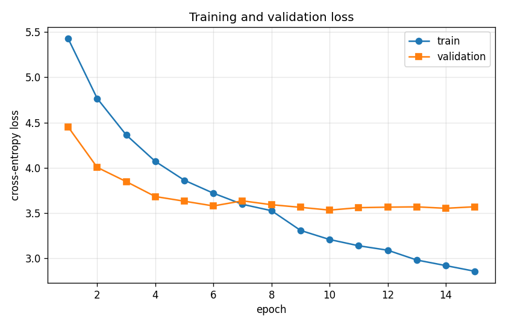
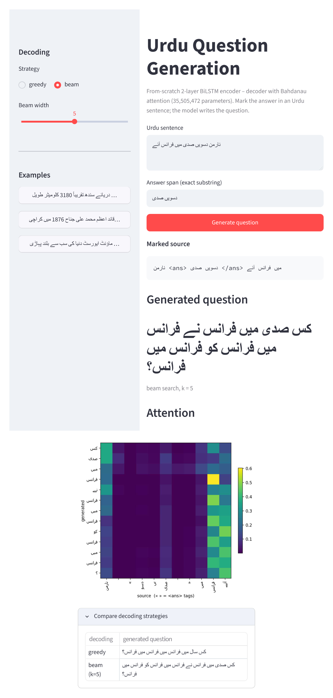
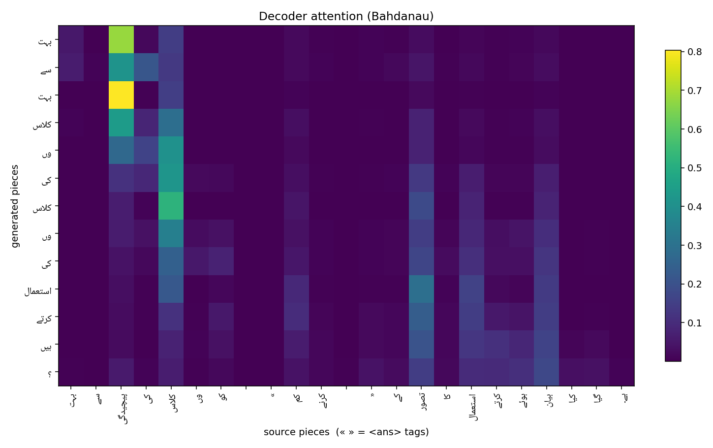

# Teaching an RNN to ask questions in Urdu — from scratch

*Building a sequence-to-sequence question generator for Urdu with no pretrained
weights, no Transformers, and a vocabulary learned from the data.*

---

## The problem

Give a model an Urdu sentence with the answer marked inside it, and ask it to
produce the question that answer responds to. This is what a teacher does when
turning a paragraph into practice questions:

> Input:  `دریائے سندھ تقریباً <ans> 3180 کلومیٹر </ans> طویل ہے۔`
> Output: `دریائے سندھ کی لمبائی کتنی ہے؟`  ("How long is the Indus?")

It is a classic sequence-to-sequence task — variable-length in, variable-length
out, no fixed alignment — the same family as translation and summarisation. The
constraint that made it interesting: **build the whole thing from primitives.**
An RNN encoder–decoder with attention, `nn.Embedding` / `nn.LSTM` / `nn.Linear`
only. No pretrained anything.

## Data: only the sentence, not the paragraph

The dataset is **UQA**, a translation of SQuAD 2.0 into Urdu that keeps the
character offset of every answer. It has ~142k context–question–answer rows.

A from-scratch RNN cannot learn to read a 300-token paragraph, so — following
Du et al. (2017) — we keep only the **sentence that contains the answer**: split
the context on the Urdu full stop / question mark / `!`, take the sentence
covering the answer's character offset, wrap the span in `<ans> … </ans>`, and
pair it with the `question` field. Pairs over 60 (source) / 25 (target)
whitespace tokens are dropped.

| | Train | Validation | Wiki-UQA (OOD) |
|---|---|---|---|
| Raw rows | 124,745 | 16,824 | 210 |
| Answerable | 83,018 | 11,169 | 209 |
| Pairs after length filter | **75,236** | **10,043** | **177** |

About 40% of rows are unanswerable (dropped), and the length filter removes
outliers where a single "sentence" was really two clauses glued together.

## Tokenizer: subwords for a morphologically rich language

We learn an 8k **SentencePiece unigram** vocabulary on the training text only.
`<ans>` and `</ans>` are registered as user-defined symbols so a tag is always
exactly one token; `<pad> <unk> <s> </s>` are pinned to ids 0–3.

Unigram (rather than BPE) tends to keep frequent whole words and split only the
rarer inflected forms. On Urdu that shows up clearly:

- function words stay whole — `کے`, `میں`, `سے`
- inflected / compound forms break into stem + affix — `مقابل وں`
  (competitions: stem + oblique-plural `وں`), `پر ورش` (upbringing),
  `گلوکار ہ` (female singer: stem + `ہ`)
- rare proper nouns fragment into near-character pieces — `ڈسٹ نی` (Destiny)

That last point matters later: the model's copy errors and truncations almost
always happen on these fragmented names.

## Model

Nothing exotic — the point was to implement each piece by hand.

| Part | Choice |
|---|---|
| Encoder | 2-layer **bidirectional** LSTM, embedding 256, hidden 512, dropout 0.3 |
| Bridge | linear + `tanh` from the final encoder state to the decoder's initial state |
| Attention | Bahdanau (additive): `eₜᵢ = vᵀ tanh(Wₑ hᵢ + W_d sₜ)`, softmax over source positions, padding masked to `-∞` |
| Decoder | 2-layer LSTM with input feeding (previous context vector concatenated to the input), linear readout over `[sₜ ; cₜ ; embₜ]` |

**35.5M trainable parameters.** Training: teacher forcing (ratio 0.5),
padding-masked cross-entropy, Adam (lr 1e-3) with `ReduceLROnPlateau`, gradient
clipping at 1.0, 15 epochs, batch 64. About **81 minutes on a single Tesla T4.**

Validation loss bottoms out at **epoch 10** (loss 3.53, perplexity 34) and then
the model starts to overfit — training loss keeps falling while validation
creeps back up. We keep the epoch-10 checkpoint.

## Results

Greedy and beam (k=5) are scored on the same 3,000 validation examples;
perplexity is on the full split.

| Split | Decoding | BLEU-4 | ROUGE-L | PPL | `<unk>`% |
|---|---|---|---|---|---|
| UQA valid | greedy | **5.58** | 0.260 | 34.2 | 0.0 |
| UQA valid | beam k=5 | 1.02 | 0.126 | 34.2 | 0.0 |
| Wiki-UQA | greedy | 3.57 | 0.227 | 50.8 | 0.0 |
| Wiki-UQA | beam k=5 | 0.32 | 0.076 | 50.8 | 0.0 |

Du et al. (2017) reached BLEU-4 ≈ 12 on English SQuAD with a bigger model and
more data. Our greedy 5.58 sits just below the 6–13 band — clearly not
"≈0 = a bug", nowhere near ">30 = leakage". `<unk>` is 0 because
`character_coverage=1.0` gives every rare glyph a piece.

Ten runs through the Streamlit front end on sentences the model had never seen —
five good, five bad. (The full 60 validation outputs are in
`results/samples.tsv`.)

### Five good

| Sentence (answer) | Generated question |
|---|---|
| سورج نظام شمسی کا مرکز ہے۔ (**سورج**) | **شمسی نظام کا مرکز کیا ہے؟** — "What is the centre of the solar system?" |
| مہاتما گاندھی نے عدم تشدد کا فلسفہ پیش کیا۔ (**عدم تشدد**) | **مہاتما گاندھی نے کیا فلسفہ پیش کیا؟** — "What philosophy did Gandhi present?" |
| ماؤنٹ ایورسٹ … جو نیپال میں واقع ہے۔ (**نیپال**) | **ماؤنٹ ایورسٹ کہاں واقع ہے؟** — "Where is Everest located?" (beam; greedy said "کس واقع ہے؟") |
| چاند زمین کے گرد چکر لگاتا ہے۔ (**زمین**) | **چاند کس سمت کے ارد گرد گھومتا ہے؟** — fluent, on-topic, slightly off ("direction") |
| دریائے سندھ تقریباً 3180 کلومیٹر طویل ہے۔ (**3180 کلومیٹر**) | **دریائے سندھ کتنی ہے؟** — right question word, incomplete |

### Five bad — with failure type

| Sentence (answer) | Generated question | Failure type |
|---|---|---|
| ٹیلی ویژن کی ایجاد جان لوگی بیئرڈ نے کی۔ (**جان لوگی بیئرڈ**) | ٹیلی ویژن **کی کی** ایجاد **کی ایجاد** نے **ایجاد** کی؟ | **repetition** |
| قائد اعظم محمد علی جناح 1876 میں کراچی میں پیدا ہوئے۔ (**کراچی**) | **دد علیاح** کس پیدا ہوا تھا؟ | **mangled proper noun** — long name → gibberish |
| بازنطینی سلطنت گیارہویں صدی میں کمزور ہو گئی۔ (**گیارہویں صدی**) | بازنطینی سلطنت کس صدی میں **ہوئی**؟ | **dropped content word** — "کمزور ہو گئی" → "ہوئی" |
| نارمن دسویں صدی میں فرانس آئے۔ (**دسویں صدی**) | کس صدی میں **فرانس … فرانس … فرانس … فرانس … فرانس**؟ | **attention collapse** — every token attends to the one "فرانس" column |
| وہ ڈنمارک، آئس لینڈ اور ناروے کے نارمن حملہ آوروں … (**نارمن حملہ آوروں**) | **آئس لینڈ اور آئس لینڈ اور آئس لینڈ** کے درمیان تعلق رکھتے تھے؟ | **repetition + ignores the marked answer** |

The pattern: the model reliably gets the **question word** and sentence **shape**
right (`کب`/`کس سال` for dates, `کتنے` for quantities, `کہاں` for places), and
degrades on **content** — repeating, dropping words, mangling long proper nouns,
or (b4) collapsing all attention onto a single source token.

### Attention

For each generated piece the heat-map shows the softmax weights over the source
pieces. The generated content words concentrate sharply on the matching source
words, and the `«` `»` (the `<ans>` tags) receive almost no weight — the model
learned they are markers, not content.

## Discussion

**Which question words work?** Temporal (`کب`, `کس سال`) and quantity (`کتنے`)
are the most reliable — they are frequent in the data and cued strongly by a
numeric answer span. `کون` ("who") is hit-or-miss, and the model rarely gets the
finer distinctions (`کہاں` vs `کس ملک میں`) right.

**Where does beam search help, and where does it hurt?** It hurts — badly. Beam
BLEU-4 is 1.02 against greedy's 5.58. Beam approximately maximises the whole-
sequence probability `P(question | source)`, and an under-trained model puts
high probability on a handful of fluent, generic question templates that score
well *almost regardless of the source*. So wide-beam search finds and recycles
them: several different source sentences all produce
*"فرانس کے خطے کو کب نام دیا گیا تھا؟"*. Greedy avoids this because it commits
token by token, following the attention distribution, so it stays anchored to
the answer. This is the well-documented **beam-search degradation** on weak
models — larger beams lowering BLEU (Koehn & Knowles, 2017), the exact search
optimum being degenerate (Stahlberg & Byrne, 2019). A `k=1` beam returns exactly
the greedy output, which confirms the search itself is implemented correctly.

**Why does Wiki-UQA drop?** BLEU falls from 5.58 to 3.57, perplexity rises from
34 to 51. Wiki-UQA is out of domain *and* human-written, whereas the training
questions are **translated** from English SQuAD. Translated text has a narrower,
more regular phrasing distribution; the model fits that and is then surprised by
natural Urdu — a reminder that training on translated data teaches the
translation's quirks as much as the language.

## Wrap-up

A 35M-parameter RNN, trained from scratch for 81 minutes, learns the *shape* of
Urdu question generation — the right question word, attention that lands on the
answer — but not the *content*. The bottleneck is model capacity and data
quality, not the architecture. Code, notebook and trained weights:
**https://github.com/Hanzala-12/urdu-question-generation**
